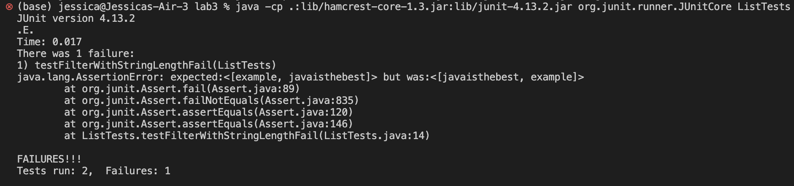

# Lab Report 3
## Bugs and Commands

### Part 1 - Bugs
Suppose the `StringChecker` interface is implemented as follows:
```
class StringLength implements StringChecker {
    private String stringToCheck;

    public StringLength(String inputString) {
        this.stringToCheck = inputString;
    }

    @Override
    public boolean checkString(String s) {
        return this.stringToCheck.length() < s.length();
    }
}
```
- failure-inducing input:
```
@Test
public void testFilterWithStringLength() {
    List<String> input = Arrays.asList("hello", "world", "example",
                                        "javaisthebest", "code");
    StringChecker checker = new StringLength("hello");

    List<String> expected = Arrays.asList("example", "javaisthebest");
    List<String> actual = ListExamples.filter(input, checker);

    assertEquals(expected, actual);
}
```
- no-failure input:
```
@Test
public void testFilterWithStringLengthPass() {
    List<String> input = Arrays.asList("hello", "world", "example",
                                        "javaisthebest", "code");
    StringChecker checker = new StringLength("JavaIsBest!");

    List<String> expected = Arrays.asList("javaisthebest");
    List<String> actual = ListExamples.filter(input, checker);

    assertEquals(expected, actual);
}
```
- 
- Fix Bugs
    - Before: 
        - ```
        static List<String> filter(List<String> list, StringChecker sc) {
            List<String> result = new ArrayList<>();
            for(String s: list) {
                if(sc.checkString(s)) {
                    result.add(0, s);
                }
            }
            return result;
        }
        ```
    - After: 
        - ```
        static List<String> filter(List<String> list, StringChecker sc) {
            List<String> result = new ArrayList<>();
            for(String s: list) {
                if(sc.checkString(s)) {
                    result.add(s);
                }
            }
            return result;
        }
        ```
- This fixed the bug as originally the `0` in the method argument asks the method to add the second argument to the first position of the arraylist. By removing the optional index argument, `.add()` adds to the end of the arraylist by default, hence preserving the order as desired.

### Part 2 - Researching Commands
I choose to look further into the command `grep`. I asked **ChatGPT** to give me some different and interesting ways to work with the `grep` command:
1. `grep -r --exclude-dir='excluded_dir' 'pattern' /path/to/directory`
    - ```
        (base) jessica@Jessicas-Air-3 technical % grep -r --include='*.txt' \
        > --exclude-dir='biomed' '' . | head -n 5
        ./government/About_LSC/LegalServCorp_v_VelazquezSyllabus.txt:
        ./government/About_LSC/LegalServCorp_v_VelazquezSyllabus.txt:
        ./government/About_LSC/LegalServCorp_v_VelazquezSyllabus.txt:
        ./government/About_LSC/LegalServCorp_v_VelazquezSyllabus.txt:
        ./government/About_LSC/LegalServCorp_v_VelazquezSyllabus.txt:SUPREME COURT OF THE UNITED STATES
        ```
    - This command tries to find the pattern in given directory. Here we also ask to only show the first 5 lines of the output. This can be helpful when you only want to look for the pattern that exist in specific subdirectories.
    - ```
        (base) jessica@Jessicas-Air-3 technical % grep -r --include='*.txt' \
        > --exclude-dir='biomed' --exclude-dir='government' '' . | tail -n 5
        ./911report/chapter-11.txt:                Back-page notices told of tightened security at embassies and military installations
        ./911report/chapter-11.txt:                abroad and government cautions against travel to the Arabian Peninsula. All the rest
        ./911report/chapter-11.txt:                was secret.
        ./911report/chapter-11.txt:        
        ./911report/chapter-11.txt:    
        ```
    - This command tries to find the pattern in given directory, exluding the subdirectory that is provided as an argument. This can be helpful when you only want to look into specific subdirectories, as you can specify more than one subdirectory to *not* look into.

2. `grep -c 'pattern' filename.txt` or `grep -rc 'pattern' /path/to/directory`
    - ```
        (base) jessica@Jessicas-Air-3 technical % grep -rc '*science*' . \
        > | head -n 5
        ./government/About_LSC/LegalServCorp_v_VelazquezSyllabus.txt:0
        ./government/About_LSC/Progress_report.txt:0
        ./government/About_LSC/Strategic_report.txt:0
        ./government/About_LSC/Comments_on_semiannual.txt:0
        ./government/About_LSC/Special_report_to_congress.txt:0
        ```
    - This command finds the pattern in a given directory recursively, and counts the number of times the pattern occurs. It can be useful when one wants to find whether some keywords exist in the files of a specific directory.
    - ```
        (base) jessica@Jessicas-Air-3 technical % grep -c '*science*' ./biomed/1468-6708-3-1.txt ./biomed/1468-6708-3-3.txt
        ./biomed/1468-6708-3-1.txt:0
        ./biomed/1468-6708-3-3.txt:0
        ```
    - This command finds the pattern in a set of files, or in a given directory recursively, and counts the number of times the pattern occurs. It can be useful when one wants to find whether some keywords exist in files of interest.

3. `grep -A 2 'pattern' filename.txt` or `grep -B 2 'pattern' filename.txt`
    - ```
        (base) jessica@Jessicas-Air-3 technical % grep -A 2 'science' \
        > ./911report/chapter-2.txt  
                        satisfy its own conscience and justify its existence."
                
                    Three basic themes emerge from Qutb's writings. First, he claimed that the world was
        --
                        humanities and social sciences. Many of these young men, even if able to study
                        abroad, lacked the perspective and skills needed to understand a different culture.
                    Frustrated in their search for a decent living, unable to benefit from an education
        ```
    - These commands show the specified number of lines *after* the given pattern with the `-A` flag. This can be useful when you want a brief grasp of the context around the word or pattern of interest.
    - ```
        (base) jessica@Jessicas-Air-3 technical % grep -B 2 'science' \
        > ./911report/chapter-2.txt  
                        enormous loathing of Western society and history. He dismissed Western achievements
                        as entirely material, arguing that Western society possesses "nothing that will
                        satisfy its own conscience and justify its existence."
        --
                        attention to the rest of the world's thought, history, and culture. The secular
                        education reflected a strong cultural preference for technical fields over the
                        humanities and social sciences. Many of these young men, even if able to study
        ```
    - These commands show the specified number of lines *before* the given pattern with the `-B` flag. This can be useful when you want a brief grasp of the context around the word or pattern of interest.

4. `grep -oE 'regex_pattern' file.txt`
    - ```
        (base) jessica@Jessicas-Air-3 technical % date_pattern='(January|February|March|April|May|June|July|August|September|October|November|December) [0-9]{1,2}, [0-9]{4}'
        (base) jessica@Jessicas-Air-3 technical % grep -oE "$date_pattern" \
        > ./government/About_LSC/Comments_on_semiannual.txt
        October 1, 2000
        March 31, 2001
        July 1, 2001
        March 31, 2001
        November 7, 2000
        December 7, 2000
        March 31, 2001
        March 31, 2001
        ```
    - This command helps extract the provided pattern through Regex in a given file. Here we extract the data information in the selected file.
    - ```
        (base) jessica@Jessicas-Air-3 technical % time_pattern='[0-9]{1,2}:[0-9]{2}'                 
        (base) jessica@Jessicas-Air-3 technical % grep -oE "$time_pattern" \
        > ./911report/chapter-1.txt | head -n 5
        6:00
        6:45
        6:45
        7:40
        7:45
        ```
    - This command helps extract the provided pattern through Regex in a given file. Here we extract the time information in the selected file. If one has the idea of the form of the information they want to extract, they can use regex and this command to grab all the information that follows the pattern in the file at once.


