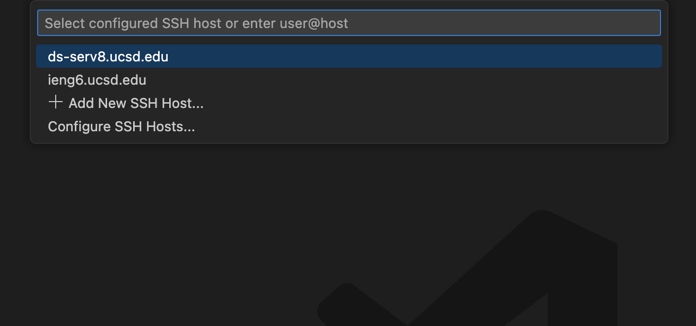
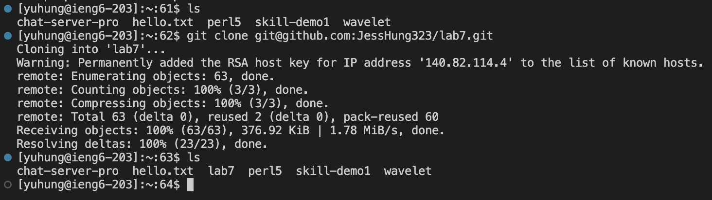
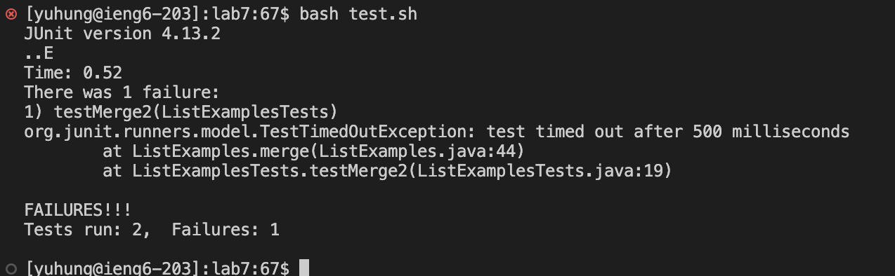
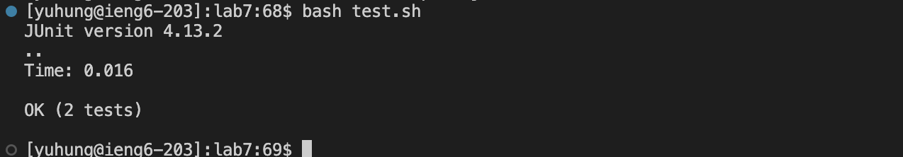
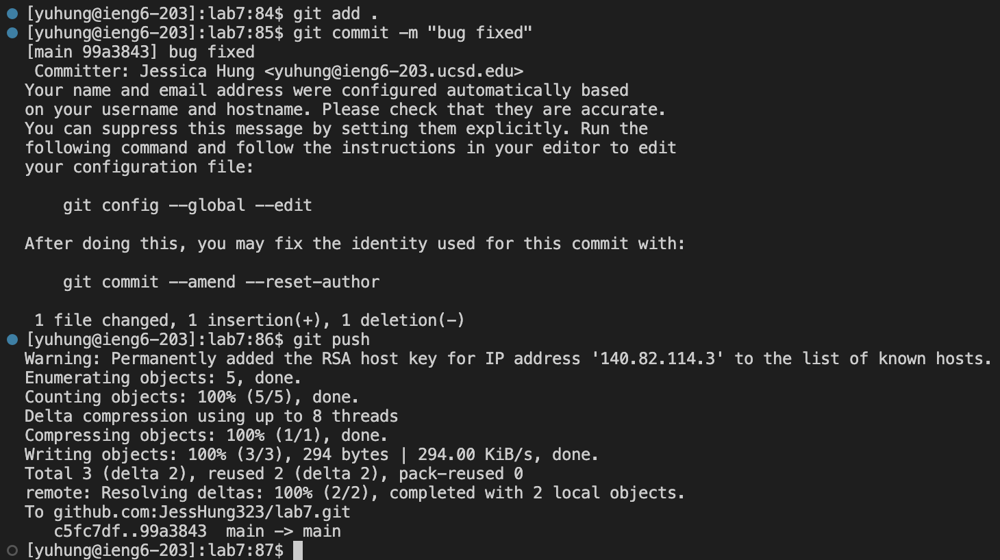

# Lab Report 4
## Doing it All from the Command Line

After completing step 1-3, we continue:

- Step 4: Since we have already set up connection to `ieng` without password on VSCode in previous labs, here we directly log into the account.
    - 
    - 
- Step 5: Now we clone the forked repo using the SSH link
    1. `git clone git@github.com:JessHung323/lab7.git`
    - 
    - I used the SSH link to clone into the repo since we are not in the local environment.
- Step 6: We run the tests and see a test has failed
    1. `bash test.sh`
    - 
    - Running the bash file will execute the commands stored within, which are used to compile the java files and run the test file that we have.
- Step 7: To fix the bug in the code, I used the following steps in the terminal
    1. `vim L<tab>.<tab><enter>`
    2. directly use the mouse to click onto the character that we are going to fix
    3. `i`
    4. `<backspace>2<esc>:wq`
    - I used `vim` to look into the file that I am to fix, which is `ListExamples.java`. I typed in `L` and then used the `<tab>` to autofill the rest of the file name. Since there exists another file named `ListExamplesTests.java`, the autofill will only show the overlapping part of the two file names, hence I then typed `.<tab>` for the file that is not the test file.
- Step 8: To run the test again, I used `<up><up>` because we executed the same command two lines ago.
    1. `<up><up><enter>`
    - 
- Step 9: I pushed the changed that I commited to my Github account
    1. `git add .`
    2. `git commit -m "bug fixed"`
    3. `git push`
    - 
    - The three commands that I used first added all the changes that I have made, commit the changes with a custom message, then officially push the changes to the Github account.