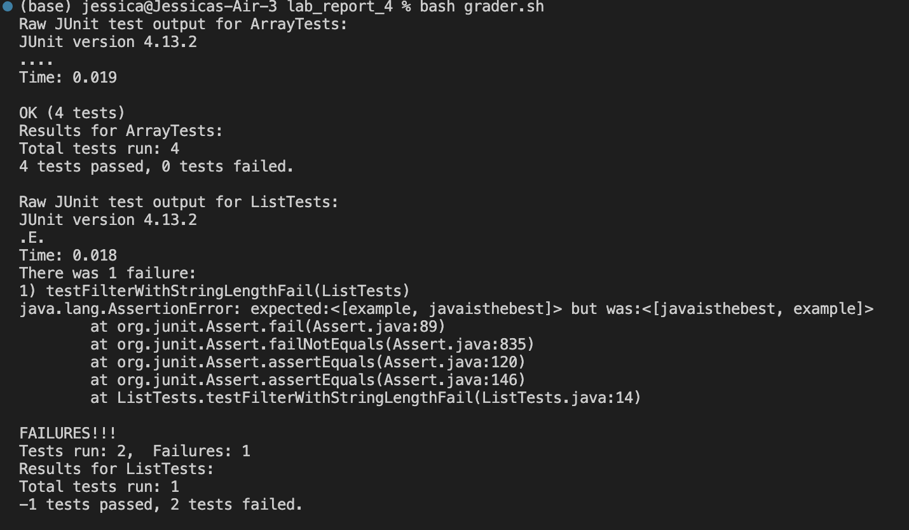
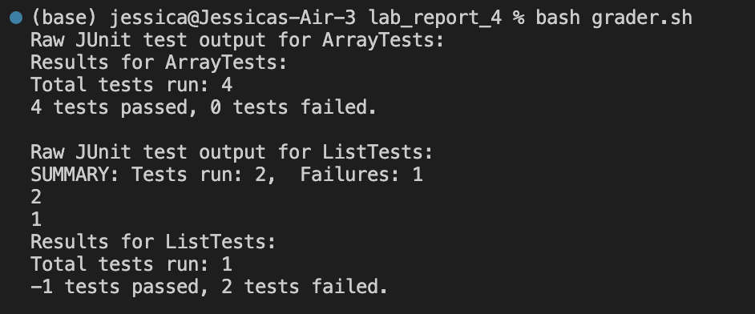

# Lab Report 5
## Putting It All Together

### Part 1
- Original Post
    - I am trying to finish a grader bash script that grades all the java test files in the current directory. The script should print out the test outcome for each test file. However, I can't seem to get the number of tests passed / failed when there is a test that did not work out. I think there might be some issue with how I parsed and extracted the information from the default ouput after running the tests. The below is the symptom from my terminal.
    - 
- TA Response
    - Hi, I would suggest that you add some echo statements in the case that deals with test files with failing test cases. You can echo the variables that store the number of failed test and number of total tests to see if you have the correct numbers that you are expecting.
- Student Followup
    - Hi, I tried your suggestions and here is the output I got.
    - 
    - I think the bug is from how I assigned the wrong number to the variables I'm using.
- The file and directory structure
    - ```
        .
        ├── ArrayExamples.class
        ├── ArrayExamples.java
        ├── ArrayTests.class
        ├── ArrayTests.java
        ├── ContainsCharacterChecker.class
        ├── FileExample.class
        ├── FileExample.java
        ├── LinkedList.class
        ├── LinkedListExample.java
        ├── ListExamples.class
        ├── ListExamples.java
        ├── ListTests.class
        ├── ListTests.java
        ├── Node.class
        ├── StringChecker.class
        ├── StringLength.class
        ├── grader.sh
        └── lib
            ├── hamcrest-core-1.3.jar
            └── junit-4.13.2.jar
        ```
    - Content in `ArrayTests.java`
        - ```
            import static org.junit.Assert.*;
            import org.junit.*;

            public class ArrayTests {
                @Test 
                public void testReverseInPlace() {
                int[] input1 = { 3 };
                ArrayExamples.reverseInPlace(input1);
                assertArrayEquals(new int[]{ 3 }, input1);
                }


            @Test
            public void testReversed() {
                int[] input1 = { };
                assertArrayEquals(new int[]{ }, ArrayExamples.reversed(input1));
            }

            @Test
            public void testReverseInPlace2() {
                int[] input2 = {1, 2};
                ArrayExamples.reverseInPlace(input2);
                assertArrayEquals(new int[]{2, 1}, input2);
            }

            @Test
            public void testReversed2() {
                int[] input2 = {1};
                assertArrayEquals(new int[]{1}, ArrayExamples.reversed(input2));
            }
            }
            ```
    - Content in `ListTests.java`
        - ```
        import static org.junit.Assert.*;
        import org.junit.*;
        import java.util.*;

        public class ListTests {
            @Test
            public void testFilterWithStringLengthFail() {
                List<String> input = Arrays.asList("hello", "world", "example", "javaisthebest", "code");
                StringChecker checker = new StringLength("hello");

                List<String> expected = Arrays.asList("example", "javaisthebest");
                List<String> actual = ListExamples.filter(input, checker);

                assertEquals(expected, actual);
            }
            @Test
            public void testFilterWithStringLengthPass() {
                List<String> input = Arrays.asList("hello", "world", "example", "javaisthebest", "code");
                StringChecker checker = new StringLength("JavaIsBest!");

                List<String> expected = Arrays.asList("javaisthebest");
                List<String> actual = ListExamples.filter(input, checker);

                assertEquals(expected, actual);
            }
        }
            ```
