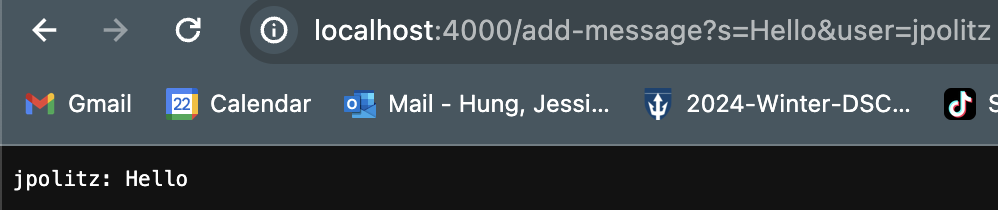
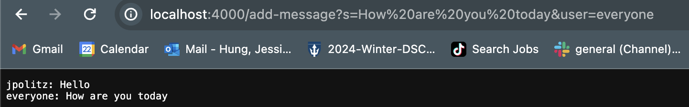

# Lab Report 2
## Servers & SSH Keys

### Part 1
- Code for `ChatServer`
    - ```
        import java.io.IOException;
        import java.net.URI;

        class Handler implements URLHandler {
            String text = "";

            public String handleRequest(URI url) {
                if (url.getPath().equals("/")) {
                    return String.format("Woops you have no input");
                } else if (url.getPath().equals("/add-message")) {
                    String[] parameters = url.getQuery().split("=");
                    if (parameters[0].charAt(parameters[0].length()-1) == 's' && parameters[1].split("&")[1].equals("user")) {
                        String message = parameters[1].split("&")[0];
                        String name = parameters[2];
                        text += name + ": " + message + "\n";
                        return text;
                    }
                } else {
                    return "404 Not Found!";
                }
                return "404 Not Found!";
            }
        }

        class ChatServer {
            public static void main(String[] args) throws IOException {
                if(args.length == 0){
                    System.out.println("Missing port number! Try any number between 1024 to 49151");
                    return;
                }

                int port = Integer.parseInt(args[0]);

                Server.start(port, new Handler());
            }
        }
        ```
    - Using `add-message` for first time after launching server:
        - 
    - Using `add-message` for second time after launching server:
        - 
